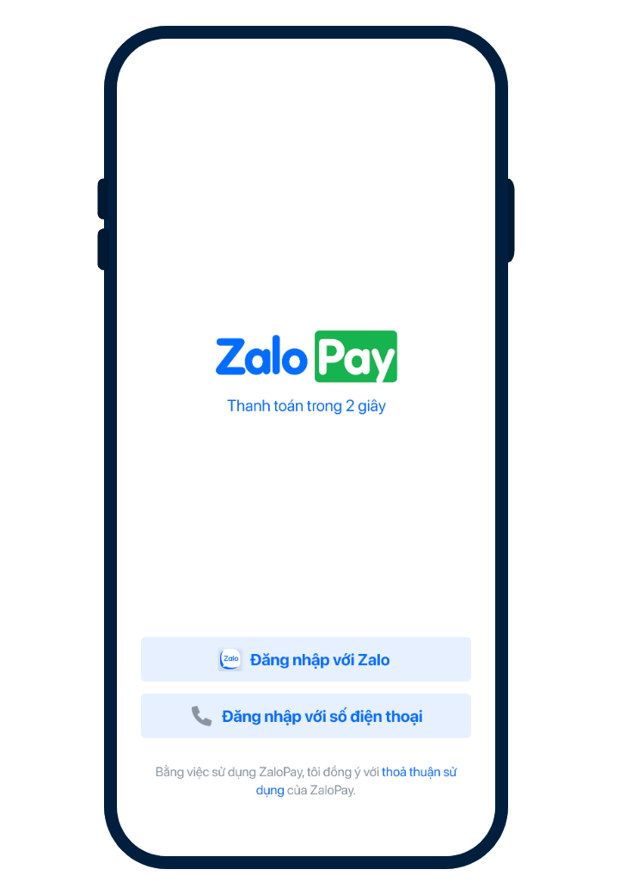
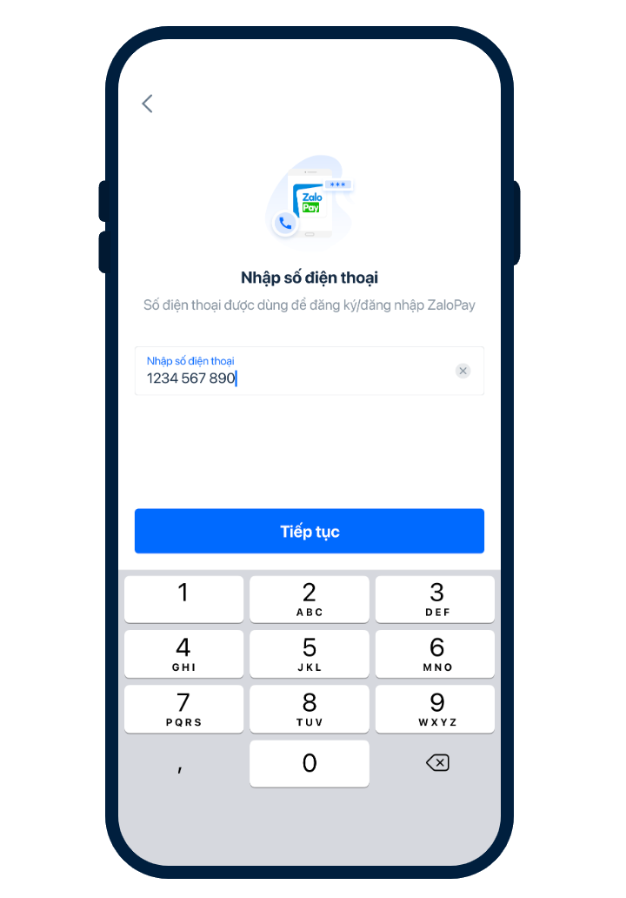
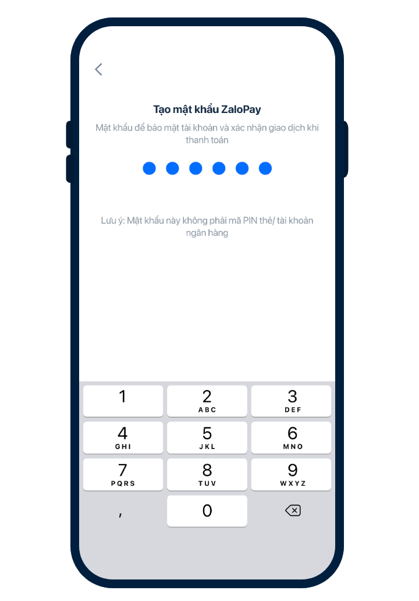

# Test wallets

- [Test wallets](#test-wallets)
  - [Overview](#overview)
  - [Installation](#installation)
  - [Registration](#registration)
  - [Deposit](#deposit)
  - [Questions](#questions)

## Overview

This repository contains ZaloPay pre-built binaries for mobile platforms (iOS, Android)

## Installation

Click/tap on the following button to install

<!-->remove iframe because of limitation on downloading build on Safari<-->

 

  

    <a
      href="itms-services://?action=download-manifest&url=https://github.com/zalopay-samples/test-wallets/raw/main/ios/8.25.0/manifest-8.25.0.plist"
      style="text-decoration: none"
    >
      

        
        

          
8.25.0 Current

          
Latest Features

        

      

    </a>
  

  

    <a
      href="https://github.com/zalopay-samples/test-wallets/raw/main/android/ZaloPay_Android_8.25.0.apk"
      style="text-decoration: none"
    >
      

        
        

          
8.25.0 Current

          
Latest Features

        

      

    </a>
  

 

Other downloads:

| Platform | ZaloPay Version | Updated Date | Download URL |
| -------- | --------------- | ------------ | ------------ |
| iOS      | 7.23.0          | 03/10/2022   | [ZaloPay_iOS_7.23.0.ipa](itms-services://?action=download-manifest&url=https://github.com/zalopay-samples/test-wallets/raw/main/ios/7.23.0/manifest-7.23.0.plist) |
| Android  | 7.20.0          | 03/10/2022   | [ZaloPay_Android_7.20.0.apk](https://github.com/zalopay-samples/test-wallets/raw/main/android/ZaloPay_Android_7.20.0.apk) |

For iOS, once the installation is successful, you should trust ZaloPay app via settings in  `Device Management`

  

Please consult [Install custom enterprise apps on iOS](https://support.apple.com/en-us/HT204460) for more information.

## Registration

**Step 1**: Open the ZaloPay app and log in using your Zalo account or mobile number.

Note: One phone number can only be linked to a single ZaloPay sandbox account.

  

**Step 2**: Enter the phone number and continue

  

**Step 3**: Enter the verification code of `111111` and continue with password setup

  

 

## Deposit

To pay with ZaloPay Sandbox, you first have to deposit some money

<iframe src="html/cashin.html" width="100%" height="350px" style="background: transparent; border: none;">
  
Your browser does not support iframes.

</iframe>

## Questions

If you have any question, feel free to [discuss](https://github.com/zalopay-samples/test-wallets/discussions)
