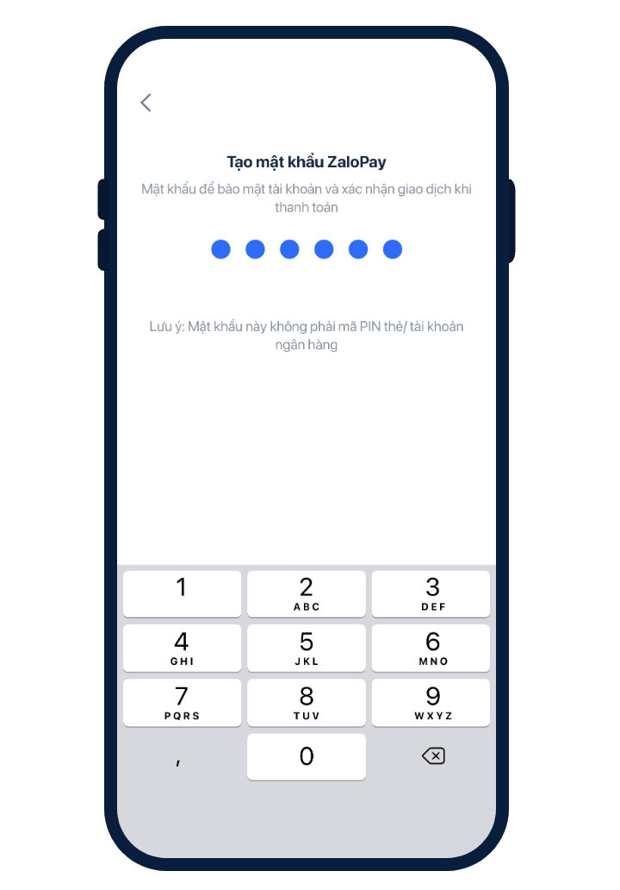

# Test wallets

- [Test wallets](#test-wallets)
  - [Overview](#overview)
  - [Installation](#installation)
  - [Registration](#registration)
  - [Deposit](#deposit)

## Overview

This repository contains ZaloPay pre-built binaries for mobile platforms

## Installation

Click/tap on the following button to install

   
  

   
  
   

For iOS, once the installation is successful, you should trust ZaloPay app via settings in  `Device Management`

  

Please consult [Install custom enterprise apps on iOS](https://support.apple.com/en-us/HT204460) for more information.

## Registration

**Step 1**: Open the ZaloPay app and log in using your Zalo account or mobile number.

Note: One phone number can only be linked to a single ZaloPay sandbox account.

  

**Step 2**: Enter the phone number and continue

  

**Step 3**: Enter the verification code of `111111` and continue with password setup

  

## Deposit

tbd (please incorporate https://docs.zalopay.vn/en/v2/start/#A-II)
